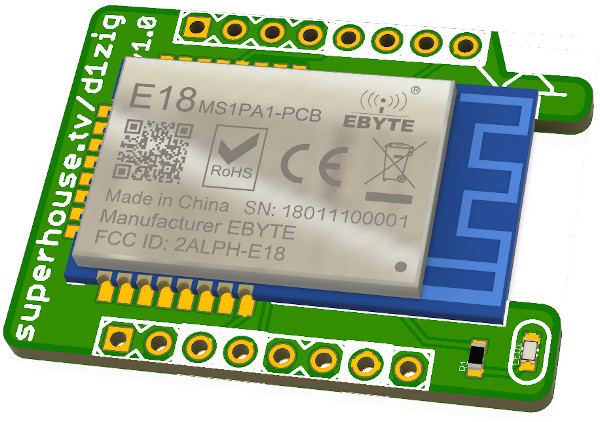

D1 Mini Zigbee Shield
=====================

Zigbee shield for Wemos D1 Mini, so that it can either be a Zigbee
Client or a Zigbee Coordinator running Zigbee2Tasmota.

Features:

 * ESP8266 to run Zigbee2Tasmota
 * CC2530 Zigbee interface
 * 3D-printable case

More information is available at:

  https://www.superhouse.tv/d1zig

Hardware
--------
The "Hardware" directory contains the PCB design as an EAGLE project.
EAGLE PCB design software is available from Autodesk free for
non-commercial use.

Credits
-------
 * Jonathan Oxer <jon@oxer.com.au>

License
-------
Copyright 2020 SuperHouse Automation Pty Ltd  www.superhouse.tv  

The hardware portion of this project is licensed under the TAPR Open
Hardware License (www.tapr.org/OHL). The "license" folder within this
repository contains a copy of this license in plain text format.

The software portion of this project is licensed under the Simplified
BSD License. The "licence" folder within this project contains a
copy of this license in plain text format.

